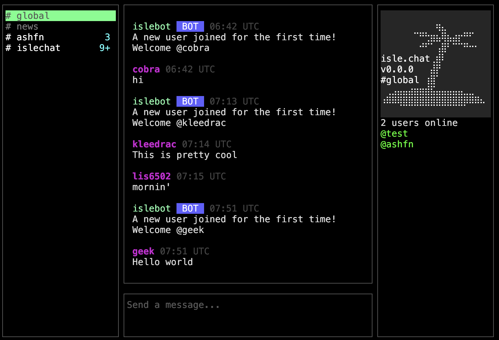

# isle.chat

An SSH-powered chat server with public and invite-only channels, persistent accounts and messages, and a Discord/Slack-style terminal interface.

Try it with:

```bash
ssh username@isle.chat
```



Built on the Charm stack: [Wish](https://github.com/charmbracelet/wish) for SSH session handling and [Bubble Tea](https://github.com/charmbracelet/bubbletea) for the terminal UI.

## Features

**Channels.** Create your own channels and make them public or private. Public channels are open to anyone; private ones are invite-only. Each channel has an owner who can set a 20×10 character banner, manage invites, and kick, ban or unban users.

**Persistence.** Accounts, messages, invites and bans are stored in SQLite or PostgreSQL, so you can SSH in from anywhere with your credentials and pick up where you left off. Passwords are hashed with bcrypt.

**Presence and unread counts.** A member list shows who's online, and private channels also list offline members. Channels with new messages show an unread count in the sidebar.

**Timezones.** Message timestamps render in your local time. Your timezone is guessed from your IP on first connect and can be changed with `/tz`, which persists across sessions.

**Command completion.** Commands are modelled as a tree of nodes, and completion is aware of where you are in it. Mentions complete against online members of the current channel, `/chan kick` and `/chan ban` over users actually in the channel, `/chan unban` over users you've banned, and `/tz` over the system zoneinfo database.

## Commands

| Command | Description |
| --- | --- |
| `/help` | Show available commands |
| `/whois <user>` | Show user info |
| `/tz <timezone>` | Show or set your timezone (alias: `/timezone`) |
| `/chan create <name>` | Create a channel |
| `/chan join <name>` | Join a channel |
| `/chan leave` | Leave the current channel |
| `/chan public` | Make the current channel public |
| `/chan private` | Make the current channel invite-only |
| `/chan invite <user>` | Invite a user |
| `/chan uninvite <user>` | Revoke an invite |
| `/chan kick <user>` | Kick a user from the channel |
| `/chan ban <user>` | Ban a user from the channel |
| `/chan unban <user>` | Lift a ban |
| `/chan banner <text>` | Set the channel banner |
| `/chan delete` | Delete the current channel |

Channel management commands apply to the channel you're currently in, and are restricted to its owner.

## Layout

```
src/main.go     server setup, sessions, message routing, shared state
src/cmd.go      command graph, dispatch and completion
src/view.go     rendering
src/models.go   database models and app/session types
src/geoip.go    IP-based timezone estimation (WIP)
```

## Self-hosting

### Docker

```bash
docker run -t -i -p 2222:2222 \
  -e CLICOLOR_FORCE=1 -e COLORTERM=truecolor -e TERM=xterm-256color \
  --tmpfs /tmp \
  -v ./ssh_keys/id_ed25519:/home/islechat/app/.ssh/id_ed25519:ro \
  -v ./config.toml:/home/islechat/config.toml \
  ashfn0/islechat
```

Images are built for `linux/amd64` and `linux/arm64` in CI and pushed to Docker Hub. A `docker-compose.yml` is included if you'd rather run it alongside PostgreSQL.

### Nix

A flake is provided with a package and a dev shell:

```bash
nix build          # build the server
nix develop        # dev shell with the Go toolchain
```

### From source

```bash
cd src && go build
```

### Configuration

Configuration lives in `config.toml`:

```toml
Host = "0.0.0.0"
Port = "2222"
ServerName = "isle.chat"          # Name of the server
AdminUsername = "admin"           # Can post in the announcement channel
BotUsername = "islebot"           # Username used for system messages
GlobalBanner = "..."              # Banner shown in #global
AnnouncementChannel = "news"      # Name of the read-only announcement channel
DefaultBanner = "..."             # Banner given to new channels
WelcomeMessage = "A new user joined for the first time! Welcome @%s. Run /help for information"
FilterPublicMessages = false      # Filter public messages for profanity
RegistrationHeader = "isle.chat registration   "

DatabaseMode = "sqlite"           # "sqlite" or "postgres"
PostgresHost = "postgres"
PostgresUser = "islechat"
PostgresPassword = "change-me"
PostgresDBName = "islechat"
PostgresPort = "5432"
PostgresSSL = "disable"
```

`%s` in `WelcomeMessage` is replaced with the new user's username.

### SSH host key

The host key is read from `.ssh/id_ed25519`, and generated automatically if it isn't there.

### IP-based timezones

Timezone estimation needs `GeoLite2-City.mmdb` in the working directory. It's free from MaxMind but requires an account, and wants updating periodically. Without it the server falls back to UTC and users can still set their timezone with `/tz`.

## Roadmap

- Public key authentication alongside username and password
- Moderators and a proper permissions system, rather than owner-only
- Friend requests and direct messages
- Theming and username colours
- External authentication providers such as LDAP/OIDC ( I.e. 'Sign in with GitHub')
- Custom bots and commands
- Discord compatible webhooks
